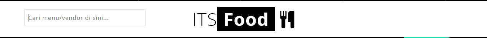
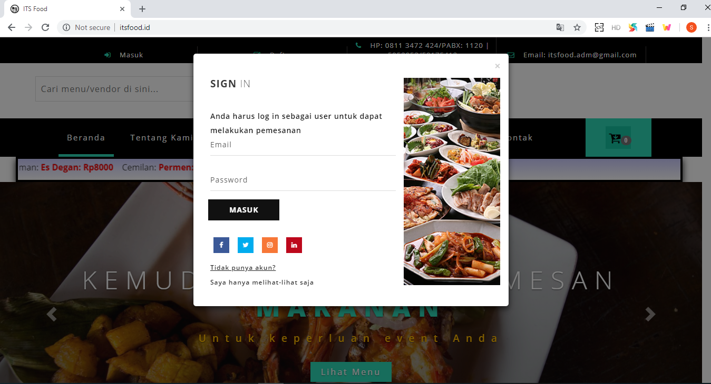
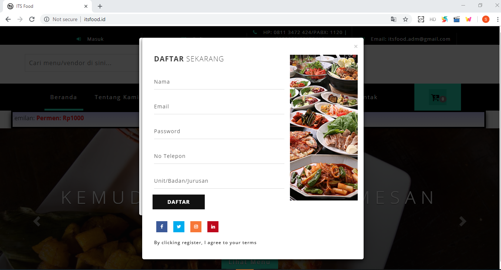
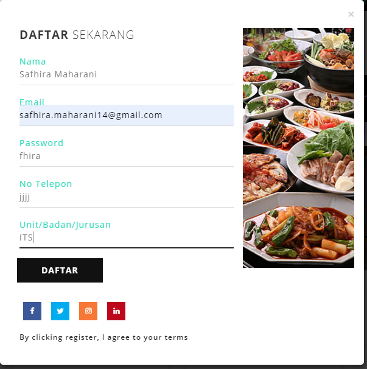
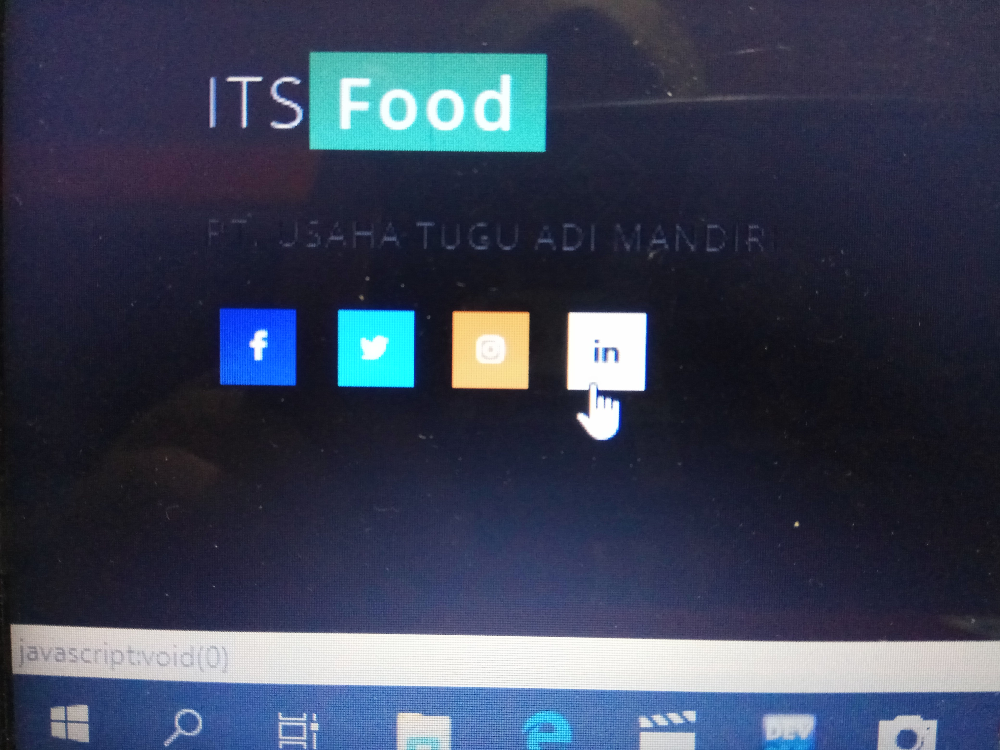

<h1> <i>itsfood.com</i> is a bad ui web design ?</h1>

	In this occasion, i will analyze one of popular website in Sepuluh Nopember Institution of Technology. it is itsfood.com. itsfood.com is a website which provide order for food, beverages and snacks. There are many of delicous food from Indonesia, Western, and Asia. While, for the beverages there are many kind Tea, Coffee, Juice and mineral water.

	In my opinion, this design website is not proporsional.

</img>

	On the top in this website, i think, it should just include sign in and register button. Phone number and email should put in footer or Information fiture.

</img>

	It should not a search vendor on the title section. Search vendor should put on the top in this website.

</img>

	On the Sign In fiture, there is no button for forgot password, if user forgot her password , there is no solusion except register again. It should have forgot password button. Next, Sign in fiture appear when we just look the food, beverages and snacks evertytime. In my opinion, this is a distruption. i think, sign in fiture should just appear when we deliver food, beverages and snacks.

</img>

	On the Register fiture, we just fill one password, there is no confirm password. If there is something wrong with the password when we register, there is no solution except register again. It should have confirm password input.

</img>

	In addition, when we fill password. we can see the password user account , it should be privacy.  When we fill phone number , there is no regex for validation, so we can fill with letter. In Indonesia, phone number must consist of number. This data become not valid.
I think , it should have a privacy for the password and regex for validation.

</img>

	There are many of button which not redirect as should be. It just become a decoration for the website. In my opinion, it should have redirect in instagram its food, facebook its food, and etc.

